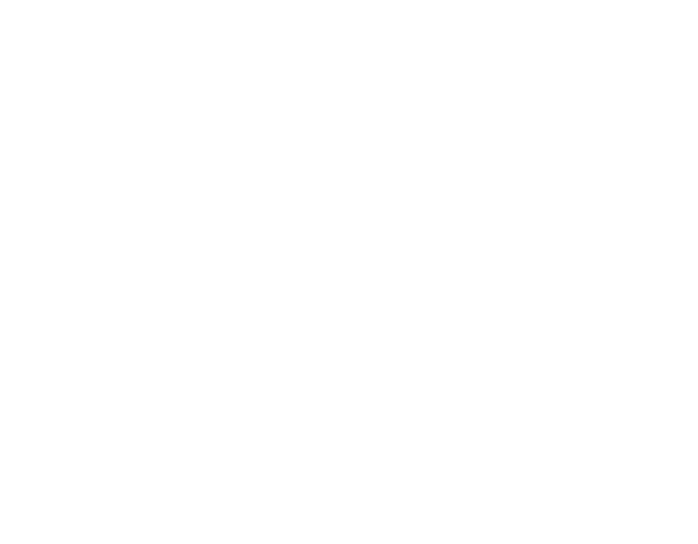

<div align="center">
  
</div>


<div align="center">
  
  
  
  
</div>

# S.M.A (Send Messages Anonymously)


## Description

S.M.A is a web application that allows users to send messages to each other anonymously. It is built using Svelte and TypeScript, with a Node.js backend and MongoDB database.

## Features

- Send and receive messages anonymously
- Toggleable profanity filter
- Real-time message updates

## Live Website

You can access the live website at [sma.robi.work](https://sma.robi.work/)


## Prerequisites

Before you begin, ensure you have met the following requirements:

- You have installed the latest version of Node.js and pnpm or yarn.
- You have a MongoDB database set up.

## Installation

### Clone the repository:

```bash
git clone https://github.com/RobiMez/sma.git
```

### Navigate to the project directory:

```bash
cd sma
```

### Install the dependencies:

Using pnpm:

```bash
pnpm i
```

Or using yarn:

```bash
yarn install
```

### Create a `.env.local` file in the root directory of the project, and add the following line:

```bash
MONGO_URI=your_mongodb_connection_string
```

Replace `your_mongodb_connection_string` with your actual MongoDB connection string.

### Start the development server:

Using pnpm:

```bash
pnpm dev
```

Or using yarn:

```bash
yarn dev
```

Now,
you should be able
to see the application running at `localhost:5000` in your web browser.


## Contributing
Contributions are welcome! 
Please fork the repository and submit a pull request.
I'll review it as soon as possible.  

## Credits
S.M.A was created by [Robi](https://github.com/RobiMez).

## License
This project is licensed under the MIT License.
